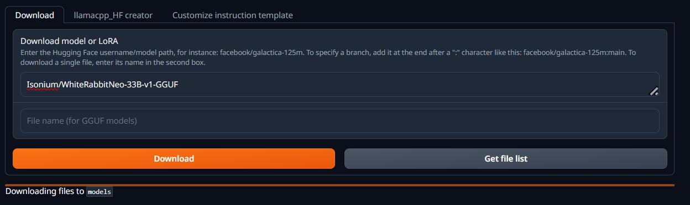

# LoLLMa: Local Large Language Model Walkthrough
### A Beginner's Guide to Harnessing the Power of LLMs Locally

Welcome to the Local Large Language Model (LLM) Walkthrough! Whether you're a data enthusiast, gamer, or hobbyist, this guide will help you unlock the potential of LLMs right from your personal computer. Here, you'll learn how to set up, manage, and interact with LLMs using an open-source UI, enabling you to experience the latest in AI technology independently of cloud services.

This guide builds on basic Python knowledge and an understanding of your hardware, paving the way for a hands-on experience with LLMs. It will guide you through the essentials of setting up your environment, choosing a model, and interacting with it through a user-friendly interface.

**What's Inside?**  
- Hardware and software requirements
- Step-by-step setup instructions
- Tips for choosing the right model with a link to a detailed guide
- How to interact with your LLM using the Oobabooga Text Generation WebUI
- A future roadmap for advanced topics and settings

## Preliminary Considerations

### Hardware Requirements
For a smooth experience with high-end models, your setup should ideally include:

- **High-End GPU**: NVIDIA RTX 3080, 3090, or 4080 with at least 16GB VRAM for optimal performance.
- **CPU**: A multi-core processor like Intel Core i9 or AMD Ryzen 9 to handle intensive tasks.
- **RAM**: Minimum of 64GB to ensure smooth multitasking.
- **Storage**: A fast NVMe SSD for quick data access and storage.

### Software Requirements
Make sure the following software is installed:

- **Python 3.11**: [Python Installation Guide](https://realpython.com/installing-python/).
- **CUDA Toolkit**: Essential for GPU utilization, [CUDA Installation Guide](https://docs.nvidia.com/cuda/cuda-installation-guide-microsoft-windows/).
- **Git**: [Git Installation Guide](https://git-scm.com/book/en/v2/Getting-Started-Installing-Git).

You can verify the installation using these commands:

```sh
python --version
nvcc --version
git --version
```

---
## Setting Up Your Local LLM Environment

Oobabooga Text Generation WebUI is an open-source project that provides a web-based interface for interacting with various language models, including those running on llama.cpp and other backends.


- **User-Friendly Interface**: Easily manage and interact with your models.
- **Multiple Backend Support**: Works with various computational backends like llama.cpp.
- **Advanced Customization**: Tailor the performance according to your system's capabilities.

### Installation Steps

1. **Clone the Oobabooga repository**:
   Navigate to your desired directory and clone the repo:
   ```sh
   git clone https://github.com/oobabooga/text-generation-webui.git
   cd text-generation-webui
   ```

2. **Setup Python Environment**:
   Create and activate a virtual environment:
   ```sh
   python -m venv lollma
   lollma\Scripts\activate
   pip install -r requirements.txt
   ```

3. **Launch the Server**:
   Start the local server with the following command:
   ```sh
   python server.py
   ```

   Access your local server at [http://localhost:7860](http://localhost:7860).


Now if all of this went smooth (lol) you can access your local server by visiting [http://localhost:7860](http://localhost:7860) in your web browser. 


### Model Management

- **Downloading Models**: Directly from the WebUI, navigate to the `Models` tab and input the model details (in our case `Isonium/WhiteRabbitNeo-33B-v1-GGUF`)  to start downloading.
- **Switching Between Models**: Easy model switching within the WebUI enhances your experimentation capabilities.


   

This will automatically generate a new folder in the `text-generation-textui/models` folder and once the download is successful you can manually load the model in this tab.

Now that your local LLM UI is up and running, you're ready to begin the ongoing process of balancing token processing speed with the desired intelligence of your local assistants. This iterative cycle will help you find the optimal setup that meets your needs for both performance and smart interaction. 


### Advanced Settings and Optimization

For those looking to push their systems further, explore our guides on:

- [Enhanced WebUI Settings](webUI_settings.md): Dive deeper into customization for an optimized experience.
- [Effective Multi-GPU Utilization](multi_gpus.md): Enhance your model's performance across mixed GPU environments.


## Creating a Script for One-Click Launch

To make launching your LLM environment as simple as a double-click, create a bash script:

1. **Open a Text Editor**: Use any text editor like Notepad on Windows or TextEdit on macOS.
2. **Enter the Script Commands**: Copy and paste the following lines into your text editor:

   ```sh
   cd path/to/text-generation-webui
   ./lollma/Scripts/activate
   python server.py
   ```

   Make sure to replace `path/to/text-generation-webui` with the actual path where your `text-generation-webui` directory is located.

3. **Save the File**: Save the file with the name `start_llm.sh`. Make sure to set the file type to 'All Files' if you’re using Windows, or use the `.sh` extension on macOS to ensure it is recognized as a shell script.

---

### Materials to come

In the future, I hope to explore training specific use-cases where one might take advantage an off-line AI assistant. 

1. 
2. Loading GPTQ Models via ExLlamav2 - a more efficient use of VRAM
3. Determining model performance
4. Training your model 