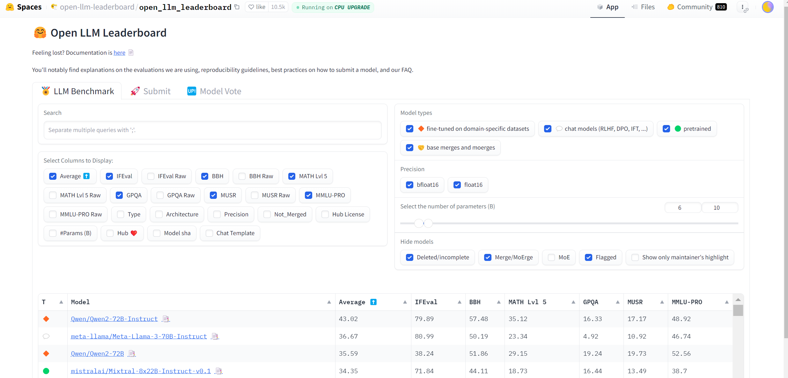

# LoLLMa [Lockett's Local LLM Ai Guide]

This guide is tailored for data enthusiasts, gamers, and hobbyists interested in managing local Large Language Models (LLMs). It covers understanding enough about Local Large Language Models to begin hosting them using an open-source UI. 

Eventually it will expand to include links that discuss the consideration and steps that go into integrating various models, training methods, and configurations, with the hopes of-- in the end-- providing a comprehensive setup for exploring the potential of LLMs on your local machine. 

By developing these skills and technologies for local models, you can ensure long-term usability and independence from external AI services.

This guide assumes you have a basic understanding of Python and your personal hardware specifications. The utilities needed for LLMs work across operating systems and can be run directly in a terminal.

In academic fashion, I will be keeping a general guide that includes software and utilities I used to get set up. Throughout this README you will find minimal instructions with links to additional learning materials.


### Hardware considerations

To effectively run higher-end models, a powerful computer setup is typically necessary. These models demand significant hardware resources, including high VRAM, processing power, and memory. 


- **High-End GPU**: Modern GPUs with at least 16GB VRAM, such as NVIDIA RTX 3080, 3090, or 4080, are recommended. Higher VRAM allows for running larger models and improves performance.
- **CPU**: A powerful multi-core CPU like Intel Core i9 or AMD Ryzen 9 is beneficial for handling non-offloaded tasks.
- **RAM**: At least 64GB of RAM is recommended.
- **Storage**: Fast SSD storage (preferably NVMe) to quickly load models and datasets.


### Software requirements

- **Python 3.11**: Follow this [Python Installation Guide](https://realpython.com/installing-python/).
- **CUDA Toolkit**: Follow this [CUDA Installation Guide](https://docs.nvidia.com/cuda/cuda-installation-guide-microsoft-windows/).

Ensure that these software tools are installed and properly configured on your system. They will need access to the PATH environment variables to function correctly. Additionally, there may be other dependencies each user needs to fulfill to get these environments running smoothly.


You can check the status of these required utilities w the following commands:

```sh
python --version
nvcc --version
```

If our utilities are running smoothly we can turn to the first step of setting up our LLM which is downloading a repository that will contain the tools to make a web app that will host our LLMs.


---

## Choosing a model to download

When selecting a model, it's crucial to consider the model's size and performance benchmarks. Here are a few leaderboards that evaluate and rank Large Language Models (LLMs):

- **Hugging Face Open LLM Leaderboard**: [Open LLM Leaderboard](https://huggingface.co/spaces/HuggingFaceH4/open_llm_leaderboard)
- **EleutherAI's lm-evaluation-harness**: [lm-evaluation-harness Leaderboard](https://github.com/EleutherAI/lm-evaluation-harness)
- **Papers with Code Leaderboard**: [Papers with Code Leaderboard](https://paperswithcode.com/sota)
- **OpenAI API Models**: [OpenAI Models](https://beta.openai.com/docs/models)




Once you review the leeadership board you are almost garaunteed to be overwhelmed by the options. Here are a few parameters that are important to understand going in:

**Parameters:** These are the core components of an LLM. Models are often named based on the number of parameters they contain (e.g., 33B means 33 billion parameters). More parameters typically mean better performance but also higher resource requirements.

**Tokens:** These are the smallest units of text the model processes. For example, the sentence "Hello, world!" would be broken down into smaller tokens for the model to analyze.

**Quantization:** This technique reduces the model's precision to save memory. For example, reducing from 32-bit floats (FP32) to 8-bit integers (Q8) reduces the memory footprint significantly.

#### Memory Usage per Parameter
- **FP32 (32-bit float):** 4 bytes per parameter
- **Q8 (8-bit):** 1 byte per parameter
- **Q6 (6-bit):** 0.75 bytes per parameter
- **Q4 (4-bit):** 0.5 bytes per parameter
- **Q5_K_S (5-bit with specific optimizations):** approximately 0.625 bytes per parameter (estimated based on typical quantization efficiency)

### Memory Calculation for a 33B Parameter Model with Q5_K_S Quantization

$$\text{Memory Requirement} = \text{Parameters} \times \text{Bytes per Parameter} $$

$$\text{Memory Requirement} = 33 \text{B} \times 0.625 \, \text{bytes} $$

$$\text{Memory Requirement} = 20.625 \, \text{GB} $$

A bit outside of the specs of our VRAM but it's a good place to start and see how long it takes to generate each token (tokens per second).

## Local LLM User Interface

Running command line prompts to your LLM takes away some of the wonderment of modern AI so most of the this tutorial is downloading an open-source UI meant to give a familiar chat experience and providing an easy way to interact with the numerous settings available to us. 

### Oobabooga Text Generation WebUI

Oobabooga Text Generation WebUI is an open-source project that provides a web-based interface for interacting with various language models, including those running on llama.cpp and other backends.


### Key Features

- **User-Friendly Interface**: Provides a web-based interface to load models, configure settings, and generate text.
- **Backend Support**: Integrates with various backends, including llama.cpp, to run models on both CPU and GPU.
- **Model Management**: Simplifies the process of downloading, setting up, and switching between different language models.
- **Customization**: Offers advanced configuration options to optimize performance based on hardware capabilities.

Once we download the repository we will have access to three key features- text-generation-webui (Oobabooga), KoboldAI, and llama.cpp- which together create a robust environment for running local LLMs. Here's how they integrate:

1. **llama.cpp**: Serves as the backend engine that performs the actual computations required for text generation. It leverages your CPU and GPU to run models efficiently.
2. **Oobabooga Text Generation WebUI**: Acts as the primary interface where you interact with the models. It simplifies model management and provides a platform for generating text. This will open as a tab in your default web browser.
3. **KoboldAI**: Provides additional features and customization options that enhance the text generation experience. It integrates within the Oobabooga interface to offer more functionality.


## Clone Oobabooga

1. **Open Command Prompt:**
   - Press `Win + R`, type `cmd`, and press `Enter`.

2. **Navigate to directory of choice:**
   - Use the `cd` command to change the directory to where your want your `text-generation-webui` folder to be located. For example:

   ```sh
   cd C:\<Your Username>\Documents\LocalLLM
   ```

3. **Clone the Repository:**
   - Clone the `text-generation-webui` repository from GitHub. Use the following command:
   ```sh
   git clone https://github.com/oobabooga/text-generation-webui.git
   ```

4. **Navigate to the `text-generation-webui` directory:**
   - Change the directory to the newly cloned `text-generation-webui`:

   ```sh
   cd text-generation-webui
   ```

5. **Set Up a Python Virtual Environment:**
   - Create a Python virtual environment:
   ```sh
   python -m venv lollma
   ```

## Download and Setup the Model


To streamline the process, let's focus on setting up the **WhiteRabbitNeo-33B-v1-GGUF** model directly within your existing `text-generation-webui` setup. Here’s how to efficiently get the model ready for use:

1. **Create the Model Directory:**
   First, manually create a new directory within `text-generation-webui/models`. You can name this directory `WhiteRabbitNeo-33B-v1-GGUF`. This can be done quickly through your operating system's file explorer by navigating to the `text-generation-webui/models` folder and creating a new folder named `WhiteRabbitNeo-33B-v1-GGUF`.

2. **Download the Model Files:**
   Visit the [WhiteRabbitNeo-33B-v1-GGUF model page on Hugging Face](https://huggingface.co/Isonium/WhiteRabbitNeo-33B-v1-GGUF/tree/main). Download the quantization version of your selected model into the folder you just created. You can do this by clicking the arrow beside the model size and saving it to your `models/WhiteRabbitNeo-33B-v1-GGUF` directory.


### Launching the Model with Python

With the model files in place, you can initiate the model through your already active Python environment:

1. **Activate Python environment and load requirements:**

   ```sh
   lollma\Scripts\activate
   pip install -r requirements.txt
   ```

2. **Start the Server:**
   Run the server with the command below (replacing folder/model w whatever model you chose):
   ```sh
   python server.py --listen --chat --n-gpu-layers 63 
   ```
Now if all of this went smooth (lol) you can access your local server by visiting [http://localhost:7860](http://localhost:7860) in your web browser. You can navigate to the models tab and manually load the model you downloaded. Once you do so, you are ready to have a conversation with your personal AI assistant.


We can check the performance of our local models by looking at the command prompt or IDE where you launched the `python server.py...` command. 

Now that your local LLM UI is up and running, you're ready to begin the ongoing process of balancing token processing speed with the desired intelligence of your local assistants. This iterative cycle will help you find the optimal setup that meets your needs for both performance and smart interaction. 


### Materials to come

In the future, I hope to explore training specific use-cases where one might take advantage an off-line AI assistant. 

1. Breakdown of Gradio UI
2. Exploring Parameter settings
3. Exploring Model settings
4. Exploring Session settings
5. Determining model performance
5. Training your model 