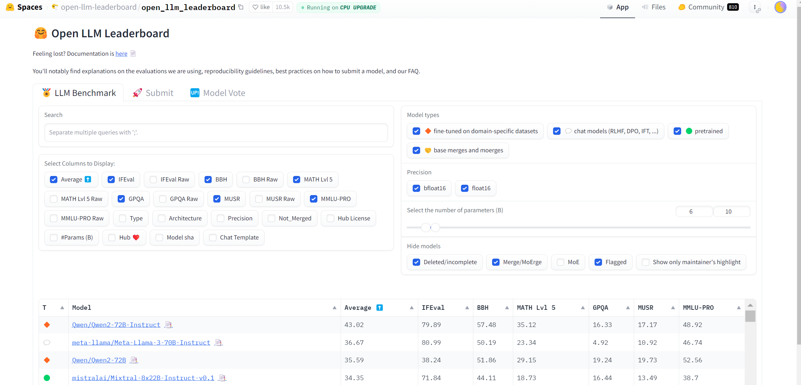

## Choosing a model to download

When selecting a model, it's crucial to consider the model's size and performance benchmarks. Here are a few leaderboards that evaluate and rank Large Language Models (LLMs):

- **Hugging Face Open LLM Leaderboard**: [Open LLM Leaderboard](https://huggingface.co/spaces/HuggingFaceH4/open_llm_leaderboard)
- **EleutherAI's lm-evaluation-harness**: [lm-evaluation-harness Leaderboard](https://github.com/EleutherAI/lm-evaluation-harness)
- **Papers with Code Leaderboard**: [Papers with Code Leaderboard](https://paperswithcode.com/sota)
- **OpenAI API Models**: [OpenAI Models](https://beta.openai.com/docs/models)

Once you review the leadership board you are almost garaunteed to be overwhelmed by the options. Here are a few definitions that are important to understand what's going on:

**Parameters:** These are the core components of an LLM. Models are often named based on the number of parameters they contain (e.g., 33B means 33 billion parameters). More parameters typically mean better performance but also higher resource requirements.

**Tokens:** These are the smallest units of text the model processes. For example, the sentence "Hello, world!" would be broken down into smaller tokens for the model to analyze.

**Quantization:** This technique reduces the model's precision to save memory. For example, reducing from 32-bit floats (FP32) to 8-bit integers (Q8) reduces the memory footprint significantly.

#### Memory Usage per Parameter
- **FP32 (32-bit float):** 4 bytes per parameter
- **Q8 (8-bit):** 1 byte per parameter
- **Q6 (6-bit):** 0.75 bytes per parameter
- **Q4 (4-bit):** 0.5 bytes per parameter
- **Q5_K_S (5-bit with specific optimizations):** approximately 0.625 bytes per parameter (estimated based on typical quantization efficiency)

### Memory Calculation for a 33B Parameter Model with Q5_K_S Quantization

$$\text{Memory Requirement} = \text{Parameters} \times \text{Bytes per Parameter} $$

$$\text{Memory Requirement} = 33 \text{B} \times 0.625 \, \text{bytes} $$

$$\text{Memory Requirement} = 20.625 \, \text{GB} $$

A bit outside of the specs of our VRAM but it's a good place to start and see how long it takes to generate each token (tokens per second).

Now that we have a bit of background information, we can move forward to downloading the tools we need to host a local LLM on our personal hardware. 
