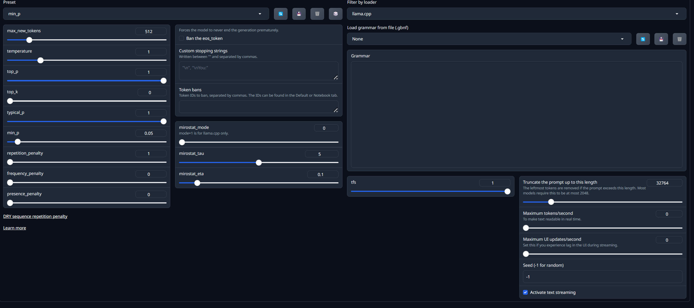

# Settings guide

Welcome to our simplified settings guide for the Oobabooga Text Generation WebUI. This guide aims to provide you with a straightforward overview of how to configure and use the various features of the WebUI efficiently. For those who require more detailed explanations and a deeper dive into each setting's capabilities, please refer to the [comprehensive guide](https://github.com/oobabooga/text-generation-webui/wiki) created by the developer. This extensive resource is perfect for users looking for granular details and advanced configuration tips. Whether you are just getting started or fine-tuning your setup, our guide, in conjunction with the developer's in-depth wiki, will ensure you have all the information you need at your fingertips.

| **Parameter** | **Description** | **Impact on Performance** | **Recommended Settings for 24GB RAM** |
|----------------|-----------------|---------------------------|---------------------------------------|
| **max_new_tokens** | Sets the maximum number of tokens the model will generate. | Higher values increase memory usage and computation time. | Set to 512 to balance quality and resource use. |
| **temperature** | Adjusts randomness in generation. | Higher values can slow down processing as more possible tokens are considered. | Set to 0.7 for a good mix of randomness and predictability. |
| **top_p** | Controls token selection based on cumulative probability. | Lower values can reduce computation as fewer tokens are considered for each step. | Set to 0.9 to reduce randomness while maintaining creativity. |
| **top_k** | Limits the number of highest probability tokens considered. | Similar to **top_p**, reducing this number can improve speed but may reduce text diversity. | Set to 40 to ensure diversity without overwhelming memory. |
| **typical_p** | Filters tokens to those more likely than a certain threshold. | Reduces the range of token probabilities considered, improving speed. | Set to 0.95 for effective filtering without over-limiting options. |
| **min_p** | Sets a minimum probability threshold for token selection. | Excludes very unlikely tokens, which can slightly increase speed. | Set to 0.01 to exclude the least likely tokens while maintaining quality. |
| **repetition_penalty** | Penalizes tokens that have been used recently, reducing repetition. | Can increase computation time as it requires tracking past tokens. | Set to 1.1 to discourage repetition without significant performance hit. |
| **frequency_penalty** | Decreases the likelihood of repeated tokens based on their frequency. | Similar impact as **repetition_penalty**. | Set to 0.8 to effectively manage frequent token use. |
| **presence_penalty** | Adjusts based on the presence of tokens, not frequency. | Slightly less computationally intensive than frequency-based penalties. | Set to 0.6 to encourage varied output without much overhead. |
| **mirostat_mode, mirostat_tau, mirostat_eta** | Specialized settings for advanced sampling techniques. | These are advanced settings that can significantly impact performance depending on their complexity. | Use default settings unless specific tuning is required; set **mirostat_mode** to 0, **mirostat_tau** to 5, **mirostat_eta** to 0.1. |

This table is designed to provide a starting point for tuning the AI model on a machine with 24 GB of RAM. Adjustments may still be needed based on specific application needs and the characteristics of the model being used.
